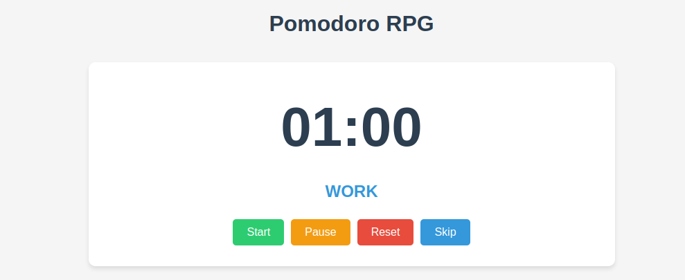

# RPG Pomodoro Timer

Un temporizador Pomodoro con elementos de gamificación RPG para hacer más divertida la productividad.

## Capturas de Pantalla

### Vista Principal del Temporizador


### Estadísticas del Personaje


### Sistema de Logros


### Misiones Diarias y Desafíos


### Personalización del Personaje


### Sistema de Energía


## Características

- **Temporizador Pomodoro Estándar**
  - Duración de trabajo configurable (predeterminado: 25 minutos)
  - Duración de descanso corto configurable (predeterminado: 5 minutos)
  - Duración de descanso largo configurable (predeterminado: 15 minutos después de 4 ciclos de trabajo)
  - Controles: Iniciar, Pausar, Reiniciar, Saltar

- **Elementos RPG**
  - Sistema de experiencia (XP) y niveles
  - Clases de personajes con habilidades únicas
  - Logros para desbloquear
  - Misiones diarias y desafíos semanales
  - Sistema de energía que fomenta hábitos de trabajo saludables

- **Personalización**
  - Clases de personajes desbloqueables
  - Temas visuales para el temporizador
  - Sonidos de notificación personalizables
  - Estilos de fondo

## Cómo Usar

1. **Configuración del Temporizador**
   - Ajusta las duraciones de trabajo y descanso en la sección de Configuración
   - Haz clic en "Guardar Configuración" para aplicar los cambios

2. **Controles del Temporizador**
   - **Iniciar**: Comienza el temporizador
   - **Pausar**: Detiene temporalmente el temporizador
   - **Reiniciar**: Reinicia el intervalo actual
   - **Saltar**: Salta al siguiente intervalo (trabajo o descanso)

3. **Sistema RPG**
   - Completa sesiones de trabajo para ganar XP
   - Sube de nivel para desbloquear nuevas clases y personalizaciones
   - Completa misiones diarias y desafíos semanales para obtener bonificaciones de XP
   - Gestiona tu energía tomando descansos adecuados

## Tecnologías Utilizadas

- HTML5
- CSS3
- JavaScript (Vanilla)
- LocalStorage para persistencia de datos

## Acceso a la Aplicación

### Versión en Línea

Puedes acceder a la aplicación directamente a través de GitHub Pages:

[Abrir RPG Pomodoro Timer](https://tu-usuario.github.io/nombre-del-repositorio)

> Nota: Reemplaza "tu-usuario" y "nombre-del-repositorio" con tu nombre de usuario de GitHub y el nombre de tu repositorio.

### Instalación Local

No se requiere instalación. Simplemente descarga el código y abre el archivo `index.html` en tu navegador web.

## Desarrollo Local

1. Clona este repositorio
2. Abre `index.html` en tu navegador
3. Para desarrollo, puedes usar un servidor local como Live Server de VS Code o Python's SimpleHTTPServer

```bash
# Usando Python para servir el proyecto
python -m http.server 8000
```

## Licencia

Este proyecto está bajo la licencia MIT. Ver el archivo `LICENSE` para más detalles.
